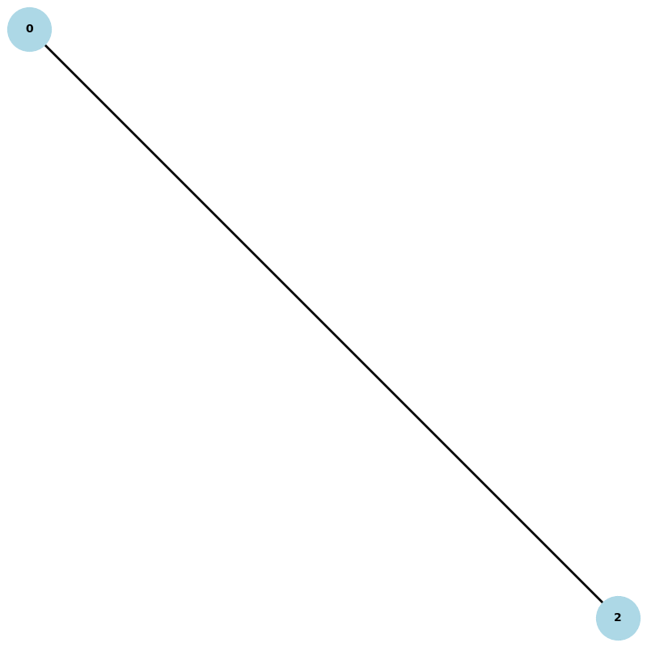

# Contact-Tracing

## Installation

1. Installing torchreid : 

    ```
    git clone https://github.com/KaiyangZhou/deep-person-reid.git

    # create environment
    cd deep-person-reid/
    conda create --name torchreid python=3.7
    conda activate torchreid

    # install dependencies
    # make sure `which python` and `which pip` point to the correct path
    pip install -r requirements.txt

    # install torch and torchvision (select the proper cuda version to suit your machine)
    conda install pytorch torchvision cudatoolkit=9.0 -c pytorch

    # install torchreid (don't need to re-build it if you modify the source code)
    python setup.py develop
    ```

2. Download Yolo File :
    
    Download all the Yolo-coco data from [here](https://drive.google.com/drive/folders/1YJymHQ9xW9w12slCPS4aq_pfqvsfAbSE?usp=sharing) and place it into the ***yolo-coco*** directory.

3. Download Model :

    We are by default using the *osnet_x1_0* model. Download the model from [here](https://drive.google.com/file/d/1tuYY1vQXReEd8N8_npUkc7npPDDmjNCV/view?usp=sharing) and place it inside the ***model*** directory. Alternatively you can also explore other models from [torchreid model zoo](/model/instruction.md)

4. Networkx Installation:
    
    ```
    pip install networkx
    ```
    
    Also make sure that your decorator version is 5.0.6. It doesn't work with 5.0.0-5.0.4 or 5.0.6. It does work with <=v4 and with >=5.0.7

## Instruction to run

1. Create folders ***past_ppl*** and ***Output*** 
2. Now run ```python tracing_reid.py``` in conda torchreid environment.

## Results
### Video :
<!-- blank line -->

<!-- blank line -->
### Graph:
<!-- blank line -->

<!-- blank line -->

# Contributors:

- <a href="https://github.com/delta-ng"> Prakash R </a>
- <a href="https://github.com/shwetapardeshi1"> Shweta Pardeshi </a>
- <a href="https://github.com/jethva-utsav"> Jethva Utsav </a>
- <a href="https://github.com/madhav-tiwari"> Madhav Tiwari </a>
